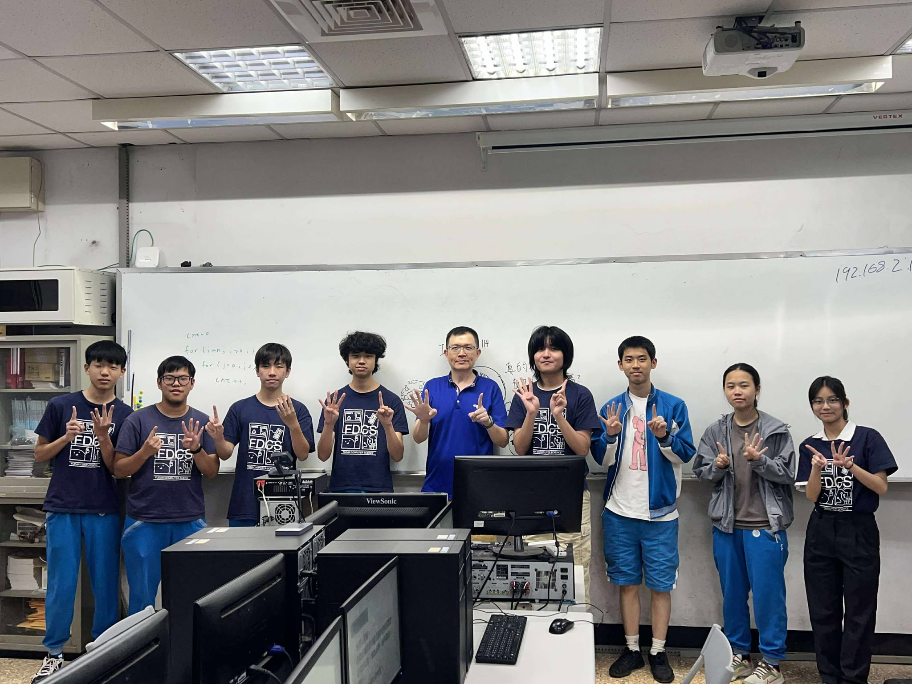
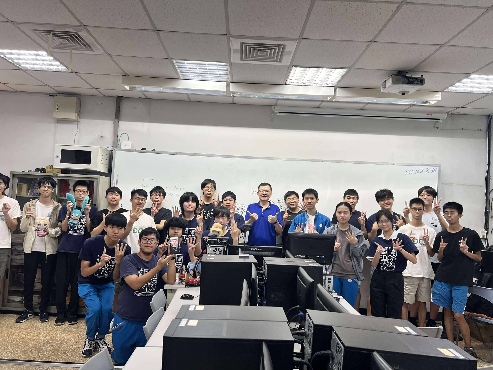

2025 8/9~8/10 程設班第十四屆幹部訓練 圓滿落幕

Day 1

第一天是活動，除了慣例的破冰遊戲能認識從第0屆到第14屆的幹部外，也有造飛機、羅馬競技生死鬥及重頭戲--解謎。在玩樂中認識學長學姊、共同合作並解決問題。

Day 2

第二天是14屆幹部面試與試教，在學長姐的點評和講解之下，教學組傳授學員們常見的盲點與教學技巧、行政組則為開學後的迎新活動做進一步的策畫與修正，為正式開課前做最好的準備，以歡迎程式設計班每位學員的到來。

圖(一) 14屆幹部與指導老師合照

圖(二) 感謝學長姐們蒞臨指導!!!

第14屆復旦程式設計班已經開放報名啦!!! 不論你是C++初學者，抑或已有一定程式基礎，都歡迎報名加入! 報名只到8/30，要報要快!!!

報名連結-> [https://forms.gle/t6RnCWcuYejr4WkQ6](https://forms.gle/t6RnCWcuYejr4WkQ6)

活動照片:

