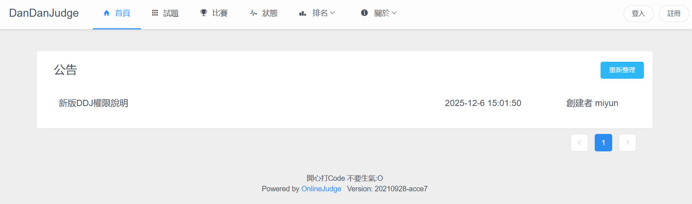
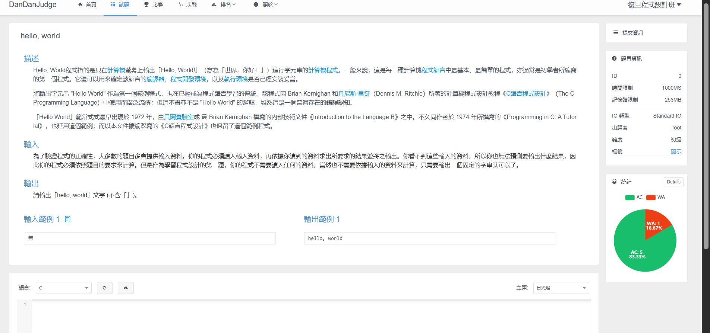
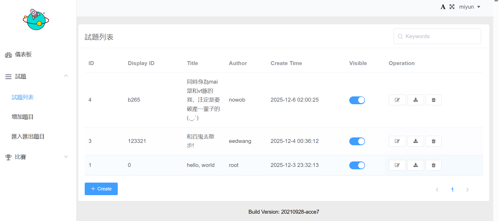

# 新版DDJ使用說明
關於新版解題農場的大小事

# 為什麼會需要第二代解題農場?
點我[進入](https://dandanjudge.nowob.me/)第二代解題農場

原版[解題農場](https://dandanjudge.fdhs.tyc.edu.tw/)(Dandanjudge，以下簡稱DDJ)從2014年第五屆程式設計班開始運營，至今已九年，原版採用zero judge，由於該系統不公開程式碼(使用虛擬機，閉源)，DDJ已堪稱步入年老失修的狀態，其部分機制隨著時代的演進、解題題目的增加早已不合時宜，因此近年來學長姊積極尋覓新的落角處。

# 新版DDJ介紹
新版DDJ由第十四屆進階助教[nowob](https://github.com/itznowob)設立。 ~~如果覺得叫新版原版太麻煩，也可以考慮稱他為nowob judge。~~ 新版DDJ以青島大學Online Judge為雛型，後續幾個月將陸續開發使用者介面、優化出題功能。目前新版DDJ架設於nowob的個人網域，原網址仍為原版DDJ。

## 介面介紹
### 一般使用者(學員)
點進去DDJ如圖一所示，中間是公告，點擊標題可查看內文。

右上角點擊註冊後如圖二。
使用者名稱一經註冊後不可更改，可自訂。
Email填自己常用的就好。
註冊完成之後會需要重新登入。

重新登入後，點擊主頁右上角的使用者名稱，會跳出一個選單，點選Settings進入頁面。 **請在Real Name處打上自己的本名(程設班學員、二篩學員、插班考考生請務必填寫此欄)** ，如果要更改語言設定，在下方的Language，有英文、簡中、繁中三種可選。

點擊上方橫幅的「試題」可看到所有題目。

點擊題目標題進入題目，滑到最底下的框框可以提交程式碼(記得選擇程式語言!)如果要看大家的提交情況，在右上方的「提交資訊」。

競賽使用說明等12/18上學期課程結束之後再更新上來，期末考當天也會說明要如何操作。

### 出題者

登入後點擊右上角的使用者名稱，會出現「後台管理」的選項，點擊後會跳轉到新介面。

進入後台之後，點擊旁邊「試題」就可以看到題目了。(Admin Basic 只能看到自己的題目)

## 權限說明及出題教學

### 權限說明
新版DDJ的出題權限須由管理者手動給予，目前分為以下四種權限:
1. Super Admin : 所有權限的賦予者、可以發公告，僅有宏智老師及參與新版DDJ開發的人可持有。
2. Admin Advanced: 題目管理員，可管理所有的題目及出題。當屆程式設計班班長及當屆資研社社長可持有此權限。若教師有需求，亦可以提出申請。
3. Admin Basic: 出題者，僅可管理自己的題目。任何需要此權限的人皆可以提出申請，目前僅開放原版DDJ持有出題權限的人申請，未來將研擬其他申請管道。
4. Regular User: 一般使用者/學員，註冊帳號即擁有此權限

### 出題權限申請
目前僅開放原版DDJ持有出題權限的人申請。
點我填寫[表單](https://forms.gle/nCNzDShfhNDdxRJB6)

### 出題教學
需擁有Admin或更高權限才有此功能。

1. 點擊 problem 後可以點 problem list 看到現在所有的題目，而其中的 create problem 則可以建立題目，點擊他
2. 相信上面大家都會使用，需要注意的是 sampleX，X 為數字，則是顯示在題目上的範例測資中，實際的官方測資則是要從這裡加入
3. Choose File 中加入檔案，其中filename.in 是程式輸入的題目資料
，filename.out 則是程式輸出的正確資料。而旁邊的type分為ACM及OI制，ACM制全對才給分，而OI制對測資就給分，有部分給分。(APCS為OI制；CPE為ACM制)

---
# 聯絡名單

如果您對於新版DDJ有任何疑惑，還請寄信詢問。

| 姓名   | 暱稱  | 電子郵件                   | 負責項目           |
| ------ |:----- |:-------------------------- |:------------------ |
| 黃禹程 | nowob | s311166@gm.fdhs.tyc.edu.tw | 技術提供、網站維護 |
| 李萱雅 | Miyun | s311273@gm.fdhs.tyc.edu.tw | 資格審核、行政事務 |
