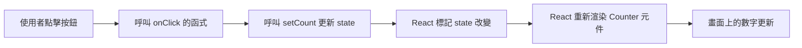

import CounterExercise1 from '@site/src/components/Web_textbook_react/react_textbook/Chapter1.tsx';

# <span class="chapter_title">Chapter 1. </span>
# <span class="chapter_subtitle"> React 基礎語法 </span>
:::tip[]
*下述內容如果想自己嘗試看看的話，[請參考](./Chapter0#0-1-如何開啟一個react專案)
:::
## 1-1. Component (組件)
- React UI 是由組件組成的。組件是可重複使用的 UI 單元。  
- 分為 Function Component（函式組件） 和 Class Component（類別組件） 
- *新專案幾乎只用 函式組件。  
    :::note[範例]
    ```tsx live
    function MyButton() {
        return (
            <div>
                <h1>不難注意到 底下是一顆按鈕</h1>
                <button>Click me</button>
            </div>
        );
    }
    ```
    :::
    :::info[也可以在其他組件裡面呼叫]
    ```tsx
    function Father() {
        return (
            <MyButton />
        );
    }
    // 這時我們叫 Father 是 MyButton 的父組件

    // 這時我們叫 MyButton 是 Father 的子組件
    ```
    :::tip[1-1語法小學堂1]
    ```tsx live
    function Father() {
        function MyButton() {
            return (
                <div>
                    <h1>不難注意到 底下是一顆按鈕</h1>
                    <button>Click me</button>
                </div>
            );
        }
        return (
            <MyButton />
        );
    }
    /* 合法 */
    ```
    :::


## 1-2. Props (參數? <small><small>沒有官方的中文譯名</small></small>)
- Props 是父組件傳給子組件的資料。
- Props 是 **唯讀**（不能在子組件內直接修改）。
    :::note[範例]
    ```tsx live noInline 
    function MyButton({ text }) {
        return (
            <div>
                <h3>不難注意到 底下寫著{ text }是一顆按鈕</h3>
                <button>{ text }</button>
            </div>
        );
    }

    function Father() {
        return (
            <MyButton text="Don't click me" />
        );
    }
    render(<Father />); /* 把<Father />渲染 */
    ```
    :::

## 1-3. 事件處理  
React 的事件命名採**駝峰式 (camelCase)**，並傳入函式。  
當事件發生時該函式就會被運行。
:::note[範例]
```tsx live
function MyButton() {
    function handleClick() {
        alert("Button clicked!");
    }

    return <button onClick={handleClick}>Click me</button>;
}
```
:::

## 1-4. export & import

- ### export default
將一個 Component 指定該檔案的「唯一主要輸出」，其他檔案要使用他時可以任意命名。
:::note[範例]
```tsx
// text.tsx
export default function Text() {
  return <p>我是文字 文字不好吃</p>;
}
```

```tsx
// App.tsx
import Delicious from './text';
<Delicious />
```
:::

- ### named export
使檔案裡的多個功能可以被其他檔案使用。
:::note[範例]
```tsx
// text.tsx
export default function Text() {
  return <p>我是文字 文字不好吃</p>;
}
```

```tsx
// App.tsx
import {Text} from './text';
<Text />
```
:::warning[named export 要加大括號]
:::


## 1-5. State (狀態?)
組件內部的資料，使用 useState 管理。
:::info[簡單來說...]
在 C++ 中，如果你要讓一個變數的值可以在**同一函數但不同次呼叫時更新**，你可能會：

1. 把它設為 **全域變數**（在競程可以但專案... **拜託不要**）
2. 把它設為 **類別的成員變數**（封裝比較好）

在 React 中，Component本質上是「普通函數」，沒有像 C++ 類別那樣的成員變數，  
但是我們仍希望它能「記住」一些值（例如計數器的數字、輸入框的內容）要怎麼做呢？    
這時就要用 **React Hook** —— `useState`。
:::
:::note[範例]
```tsx live
import React, { useState } from 'react';
function Counter() {
    // [變數, 修改變數的方法] = useState(初始值)
    const [count, setCount] = useState(0);

    return (
        <div>
            <p>目前計數：{count}</p>
            <button onClick={() => setCount(count + 1)}>+1</button>
        </div>
    );
}
```
:::
:::tip[1-5語法小學堂1]
**`() => setCount(count + 1)`是什麼？**  
這個語法是 ES6 箭頭函數（Arrow Function），基本結構是：  
```tsx
(參數) => { 函數內容 }
// 如果只有一行內容，花括號 {} 可以省略，而且會自動 return 。
```
有點類似 C++ 中的 lambda 函式。
:::
:::tip[1-5語法小學堂2]
**`import` 語法**    
```tsx
import React from "react"        //匯入整個 module
import { useState } from "react" //匯入 module 的特定部分
import React, { useState, useEffect } from "react";
```
:::
## 1-6 渲染
看完 1-5 你可能會疑惑  
為什麼像下面這樣，按鈕沒有反應    
```tsx live
function Counter() {
    let count = 0;

    return (
        <div>
            <p>目前計數：{count}</p>
            <button onClick={() => count++}>+1</button>
        </div>
    );
}
```
這就要講到 react 是如何渲染的  
### 何謂渲染
即為程式碼把資訊*染*到你的螢幕上  
和C++把`.cpp`編譯成電腦可運行的`.exe`類似  
### react如何渲染
:::info[簡單來說...]
他會  
1. 先呼叫你的 Component (初始化)  

當你`onClick`後 他會  

2. 先執行`onClick`的函式  
3. 然後呢？  
    - 如果是正確的版本(有用`useState`)
        - 那他就會再`setCount(count + 1)`之後重新**渲染** (即重新呼叫你的 Component)  

    - 如果是錯誤的版本  
        - 就沒有然後了  

流程圖  


:::warning[不簡單的說...?]
1. **初始化元件**  
   - React 呼叫你的函式元件（Function Component）一次，得到 JSX 樹。
   - JSX 會被轉成 React Element，再由 React DOM 渲染成瀏覽器的 DOM。

2. **useState 建立狀態**  
   - useState(初始值) 會返回 `[狀態值, 更新函式]`。
   - React 會在內部儲存狀態值，讓元件重新渲染時可以保持狀態。

3. **事件觸發重新渲染**  
   - 當你在元件裡呼叫 `setN(newValue)`：
     1. React 先更新內部狀態。
     2. 再重新呼叫元件函式，重新產生新的 JSX 樹。
     3. React DOM 會比對新舊 JSX 樹，只更新有改變的部分到瀏覽器 DOM（這就是「虛擬 DOM diff」）。
:::
## 1-ex1. 課後練習1

請嘗試實現下列功能吧！  
我要兩個按鈕和一個的text  
另外有一個數值 n 初始為0  
一顆按鈕會使 n 減一  
一顆按鈕會使 n 加一  
當 n 為負數 或 大於10 時  text會顯示"這數字好奇怪，我不會數"
否則顯示該數字  
:::info[範例]
<CounterExercise1 />
:::
:::danger[歡迎在程設班官網部落格寫下自己的解法!!!]
:::
:::warning[易錯重點]
在 React 裡，每個組件的 return 必須只回傳*一個外層元素*。
```react live
function Wrong() {
    return (
        <h1>Hello</h1>
        <p>World</p>
    );
}
```
所以要用其他東西包起來  
使得只有一個外層元素  
ex.  
- 用 `<div>` 包起來
- 用語意標籤（例如 `<ul>` 包 `<li>`）
- 用 React.Fragment (\<\> ... \<\/\>)
```react live
function Wrong() {
    return (
        <h1>Hello</h1>
        <p>World</p>
    );
}
```
:::
