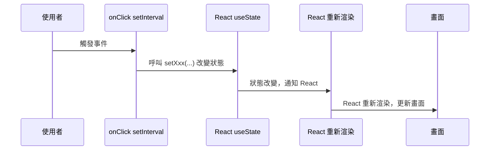

import CounterExercise1 from '@site/src/components/Web_textbook_react/react_textbook/Chapter1.tsx';

# <span class="chapter_title">Chapter 2. </span>
# <span class="chapter_subtitle"> React 進階語法 </span>

## 2-1. List Rendering（列表渲染）
在 C++ 裡，我們會用迴圈印出資料：  
```cpp
vector<string> arr = {"FDHS", "CPP", "114"};
for (auto x : arr) {
    cout << x << endl;
}
```
在 React 中，如果我們要把一個陣列「渲染」出來，就會用 `map`：  
```tsx live
function print() {
    const arr = ["FDHS", "CPP", "114"];
  return (
    <>
        {arr.map((x, index) => (
            <span key={index}>{x}_</span>
        ))}
    </>
  );
}
```
## 2-2. useEfect（副作用）
用來處理「非純渲染邏輯」的情況，例如資料請求、訂閱事件、DOM 操作。  
:::info[簡單來說...]
React 的畫面更新流程大致上是：
1. 渲染 (Render)：根據 state 和 props 把畫面「算出來」要長什麼樣。  
2. 畫面更新 (Commit)：把算好的畫面放到真正的網頁上。

但是有些事情 不是純粹的畫面計算，例如：
- 去伺服器拿資料（API 請求）  
- 設定或清除計時器  
- 監聽鍵盤/滑鼠事件  
- 直接操作 DOM  
這些和畫面計算與渲染無關的操作，我們就叫它 **side effect（副作用）** 。
:::
那什麼是`useEffect`呢？  
`useEffect`就是 React 提供的一個鉤子 (Hook)，專門放這些副作用的程式碼。  
`useEffect`有兩個參數`(函數, 陣列)`  
可以拆分成三個部分組成  
```tsx
useEffect(() => {
    console.log("Effect 啟動！"); // Effect 啟動

    return () => {  // 清理 Effect
      console.log("Component 卸載，清理 Effect");
    };
  },
  [] // 依賴陣列[]
); 
```
:::info[什麼時候會觸發`useEffect`]
- 在**組件載入時**觸發  
- 如果**依賴陣列**有東西的話 當該東西更新時也會觸發
:::
:::info[什麼時候會`return`]
- 在**組件卸載時**觸發  
- 如果**依賴陣列**有東西的話 當該東西更新**前**也會觸發
:::
範例  
```tsx live
import { useState, useEffect } from "react";

export default function Clock() {
  const [time, setTime] = useState(new Date());

  // useEffect：設定一個計時器，每秒更新一次時間
  useEffect(() => {
    const timer = setInterval(() => {
      setTime(new Date());
    }, 1000);

    // 清除計時器，避免記憶體浪費
    return () => clearInterval(timer);
  }, []);

  return <p>現在時間：{time.toLocaleTimeString()}</p>;
}
```
:::tip[2-2語法小學堂1]
`setInterval`是什麼？  
可以看到他的參數有兩個  
- \(\) => \{\}
- 1000
不難觀察到他們的資料型態，一個是函數F，一個是數字N  
而他的作用正是每固定的時間呼叫一次函數F  
:::
流程圖  


