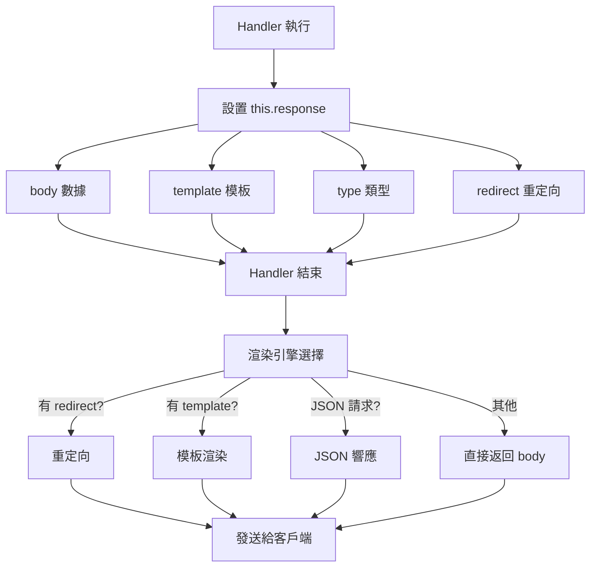

import Img, { ImgBaseProvider } from '/src/components/ImgPack';

<ImgBaseProvider base="/img/DDJv2-guide/DDJv2-addon/06-Chapter6">


# <span class="chapter_title">Chapter 6. </span>
# <span class="chapter_subtitle"> Handler Object Introduction </span>

Handler 基礎結構可先閱讀[附錄：Handler 相關附錄](../Appendix#handler-相關附錄)方便理解

## Handler 物件介紹
在 HydroOJ 中，Handler 物件代表處理 HTTP 請求的核心單元。每個 Handler 負責處理路由請求，並生成相應的響應。
```ts
import {
    Handler 
} from 'hydrooj';

class ProblemCategoryCompatHandler extends Handler {
  // GET /p/category/:category
  async get({ category }) {
    // 重定向到新的搜索頁面
    this.response.redirect = this.url('problem_main', { 
      query: { q: `category:${category}` } 
    });
  }
}

export const apply = (ctx) => {
  ctx.Route(
    'problem_category_compat',
    '/p/category/:category',
    ProblemCategoryCompatHandler
  );
};
// 如果你訪問 /p/category/math 將會被重定向到 /p?query=category:math
```

### Handler 裝飾器
HydroOJ 提供了一些裝飾器來簡化 Handler 的定義和行為控制。
0. @subscribe - 訂閱事件
```ts
// 來源: packages/hydrooj/src/handler/record.ts
export class RecordDetailConnectionHandler extends ConnectionHandler {
  rid: string = '';
  
  @param('rid', Types.ObjectId)
  async prepare(domainId: string, rid: ObjectId) {
    this.rid = rid.toString();
  }
  
  // 訂閱 record/change 事件
  @subscribe('record/change')
  async onRecordChange(rdoc: RecordDoc, $set?: any, $push?: any) {
    // 只處理匹配的記錄
    if (rdoc._id.toString() !== this.rid) return;
    
    // 發送更新到客戶端
    this.send({
      status: rdoc.status,
      score: rdoc.score,
      time: rdoc.time,
      memory: rdoc.memory
    });
  }
}
```
有沒有覺得很眼熟？ 沒錯 這就是我們上一章提到[ctx.on](../Chapter5#ctx.on())的Handler版本
所以事件種類和細節請參考[第五章](../Chapter5)的介紹

1. @param - 參數驗證
```ts
import { param, Types, ValidationError } from 'hydrooj';

class ExampleHandler extends Handler {
  // 基本類型
  @param('name', Types.String)
  @param('age', Types.Int)
  @param('email', Types.Email)
  async get(domainId: string, name: string, age: number, email: string) {
    // name, age, email 已驗證
  }

  // 可選參數
  @param('page', Types.PositiveInt, true)  // 第三個參數為 true 表示可選
  async list(domainId: string, page = 1) {
    // page 如果沒提供，使用默認值 1
  }

  // 複雜類型
  @param('tid', Types.ObjectId)
  @param('pids', Types.NumericArray)
  @param('files', Types.ArrayOf(Types.Filename))
  async post(
    domainId: string,
    tid: ObjectId,
    pids: number[],
    files: string[]
  ) {
    // 所有參數已驗證
  }
}
```
2. @post - POST 專用裝飾器
```ts
import { post, Types } from 'hydrooj';

class FileHandler extends Handler {
  // GET 請求
  async get() {
    this.response.template = 'files.html';
  }

  // POST 操作：上傳
  @post('filename', Types.Filename)
  async postUpload(domainId: string, filename: string) {
    const file = this.request.files?.file;
    if (!file) throw new ValidationError('file');
    
    await storage.put(`files/${filename}`, file.filepath);
    this.back();
  }

  // POST 操作：刪除
  @post('files', Types.ArrayOf(Types.Filename))
  async postDelete(domainId: string, files: string[]) {
    await storage.del(files);
    this.back();
  }
}
```
([storage](../Appendix#storage) 介紹 未歸檔)
3. @query - 查詢參數
```ts
import { query, Types } from 'hydrooj';

class ListHandler extends Handler {
  @query('page', Types.PositiveInt, true)
  @query('sort', Types.Range(['asc', 'desc']), true)
  async get(domainId: string, page = 1, sort = 'desc') {
    // 從 URL 查詢參數獲取: ?page=2&sort=asc
    const items = await getItems(page, sort);
    this.response.body = { items, page, sort };
  }
}
```
4. @requireSudo - 需要 Sudo 權限
```ts
import { requireSudo } from 'hydrooj';

class DangerousOperationHandler extends Handler {
  @requireSudo
  async postDelete() {
    // 需要用戶最近進行過 sudo 驗證
    // 如果沒有，會重定向到 sudo 頁面
    await deleteAllData();
    this.back();
  }
}
```

### Handler 內建方法
1. 響應相關
```ts
class ExampleHandler extends Handler {
  async get() {
    // 1. 設置模板
    this.response.template = 'example.html';
    this.response.body = { data: 'value' };

    // 2. 重定向
    this.response.redirect = '/other-page';
    // 或使用 url() 生成
    this.response.redirect = this.url('problem_main');

    // 3. JSON 響應
    this.response.body = { success: true };
    this.response.type = 'application/json';

    // 4. 二進制下載
    this.binary(fileData, 'filename.zip');

    // 5. 返回上一頁
    this.back();
    // 或帶數據
    this.back({ success: true });
  }
}
```

2. 權限檢查
```ts
class SecureExampleHandler extends Handler {
  async get() {
    // 1. 檢查權限
    this.checkPerm(PERM.PERM_EDIT_PROBLEM);

    // 2. 檢查特權
    this.checkPriv(PRIV.PRIV_USER_PROFILE);

    // 3. 檢查多個權限
    this.checkPerm(
      PERM.PERM_VIEW_PROBLEM,
      PERM.PERM_SUBMIT_PROBLEM
    );

    // 4. 條件檢查
    if (!this.user.own(pdoc)) {
      this.checkPerm(PERM.PERM_EDIT_PROBLEM);
    } else {
      this.checkPerm(PERM.PERM_EDIT_PROBLEM_SELF);
    }
  }
}
```

3. 速率限制
```ts
class RateLimitedExampleHandler extends Handler {
  async post() {
    // limitRate(操作名, 時間段(秒), 最大次數, 鍵)
    await this.limitRate('submit_problem', 60, 10);
    // 一分鐘內最多提交 10 次

    await this.limitRate('send_mail', 3600, 3);
    // 一小時內最多發送 3 次郵件

    // 自定義鍵
    await this.limitRate('create', 3600, 100, '{{ip}}');
    // 基於 IP 限制
  }
}
```

4. URL 生成
```ts
class UrlExampleHandler extends Handler {
  async get() {
    // 1. 基本 URL
    const url1 = this.url('problem_main');
    // 結果: /p

    // 2. 帶參數
    const url2 = this.url('problem_detail', { pid: 1000 });
    // 結果: /p/1000

    // 3. 帶查詢參數
    const url3 = this.url('problem_main', { 
      query: { page: 2, q: 'search' } 
    });
    // 結果: /p?page=2&q=search

    // 4. 帶錨點
    const url4 = this.url('problem_detail', { 
      pid: 1000, 
      anchor: 'solution' 
    });
    // 結果: /p/1000#solution

    // 5. 跨域 URL
    const url5 = this.url('problem_main', { 
      domainId: 'another' 
    });
    // 結果: /d/another/p
  }
}
```

5. 翻譯和渲染
```ts
class I18nExampleHandler extends Handler {
  async get() {
    // 1. 翻譯文本
    const text = this.translate('Welcome');
    
    // 2. 帶參數的翻譯
    const msg = this.translate('Hello {0}', [this.user.uname]);

    // 3. 渲染標題
    const title = this.renderTitle('Problem List');
    // 結果: "Problem List - Site Name"

    // 4. 渲染 HTML
    const html = await this.renderHTML('partial.html', { 
      data: 'value' 
    });

    // 5. 進度報告
    this.progress('Processing...', ['param']);
    // 發送消息給用戶
  }
}
```

### 渲染機制
參考[附錄：Handler 相關附錄](../Appendix#渲染機制流程圖)


#### 響應類型
1. 模板渲染（HTML）
```ts
class TemplateRenderHandler extends Handler {
  async get() {
    // 設置模板和數據
    this.response.template = 'problem_detail.html';
    this.response.body = {
      pdoc: this.pdoc,
      udoc: this.udoc,
      psdoc: this.psdoc,
    };
    
    // 框架自動渲染模板並返回 HTML
  }
}

// 渲染結果
// → Nunjucks 渲染 'problem_detail.html'
// → 傳入 { pdoc, udoc, psdoc }
// → 返回完整 HTML 頁面
```

2. JSON 響應
```ts
class JsonHandler extends Handler {
  async get() {
    const data = await fetchData();
    
    // 方式 1: 框架自動檢測
    this.response.body = { 
      success: true, 
      data 
    };
    // 如果請求頭包含 Accept: application/json
    // → 自動返回 JSON
    
    // 方式 2: 明確指定
    this.response.type = 'application/json';
    this.response.body = { data };
  }
}

// API 請求示例
// GET /api/data
// Accept: application/json
// 
// Response:
// Content-Type: application/json
// { "success": true, "data": [...] }
```

3. 重定向
```ts
class RedirectHandler extends Handler {
  async get() {
    // 方式 1: 直接重新導向 URL
    this.response.redirect = '/target-page';
    
    // 方式 2: 使用 url() 生成
    this.response.redirect = this.url('problem_detail', { 
      pid: 1000 
    });
    
    // 方式 3: 回到上一頁
    this.back();
    // 等同於
    this.response.redirect = this.request.headers.referer || '/';
    
    // 方式 4: 帶數據回到上一頁
    this.back({ success: true, message: 'Done' });
    // → 重定向 + 設置 body（用於某些場景）
  }
}

// HTTP 響應
// HTTP/1.1 302 Found
// Location: /target-page
```

4. PJAX 部分渲染
```ts
class PjaxHandler extends Handler {
  @param('page', Types.PositiveInt, true)
  async get(domainId: string, page = 1) {
    const [items, count] = await getItems(page);
    
    // 設置 PJAX 模板
    this.response.pjax = 'partials/item_list.html';
    // 或多個部分
    this.response.pjax = [
      ['partials/list.html', { items }],
      ['partials/pagination.html', { page, count }]
    ];
    
    this.response.template = 'full_page.html';
    this.response.body = { items, count, page };
  }
}

// 渲染邏輯
// 如果是 PJAX 請求：
//   → 只渲染 pjax 指定的部分
//   → 返回 HTML 片段
// 否則：
//   → 渲染完整 template
//   → 返回完整頁面
```

5. 二進制下載
```ts
class DownloadHandler extends Handler {
  async get() {
    const fileData = await readFile('example.zip');
    
    // 方式 1: 使用 binary()
    this.binary(fileData, 'example.zip');
    
    // 方式 2: 手動設置
    this.response.body = fileData;
    this.response.type = 'application/octet-stream';
    this.response.disposition = 'attachment; filename="example.zip"';
  }
}

// HTTP 響應
// Content-Type: application/octet-stream
// Content-Disposition: attachment; filename="example.zip"
// [二進制數據]
```

6. 文件流式傳輸
```ts
class StreamHandler extends Handler {
  async get() {
    // 使用存儲服務的簽名下載鏈接
    this.response.redirect = await storage.signDownloadLink(
      'path/to/file',
      'filename.pdf',
      false,  // inline (在瀏覽器中打開)
      'user'  // 權限類型
    );
  }
}

// 或直接附件
class AttachmentHandler extends Handler {
  async get() {
    const stream = fs.createReadStream('file.pdf');
    this.response.attachment('document.pdf', stream);
  }
}
```

7. 純文本響應
```ts
class TextHandler extends Handler {
  async get() {
    this.response.body = 'Plain text content';
    this.response.type = 'text/plain'; // 可選
  }
}
```

8. XML 響應
```ts
class XmlHandler extends Handler {
  async get() {
    const xml = `<?xml version="1.0"?>
      <root>
        <item>value</item>
      </root>`;
    
    this.response.body = xml;
    this.response.type = 'application/xml';
  }
}
```

## 模板系統
HydroOJ 使用 Nunjucks 作為模板引擎：
詳細結構請參考附錄中的[模板系統相關附錄](../Appendix#模板系統相關附錄)

模板渲染剛剛介紹 Handler 中已有介紹 （什麼 你沒看到？ [回去看一遍！](#響應類型) 

模板渲染示例
```ts
class TemplateExampleHandler extends Handler {
  async get(domainId: string, pid: number) {
    const [pdoc, psdict, udoc] = await Promise.all([
      problem.get(domainId, pid),
      problem.getStatus(domainId, pid, this.user._id),
      user.getById(domainId, this.user._id)
    ]);
    
    // 設置模板
    this.response.template = 'problem_detail.html';
    
    // 設置數據
    this.response.body = {
      pdoc,      // 題目數據
      psdict,    // 狀態數據
      udoc,      // 用戶數據
    };
  }
}
```
對應的 Nunjucks 模板(problem_detail.html)：
```nunjucks
<!-- problem_detail.html -->



<div class="problem">
  <!-- 訪問 Handler 傳入的數據 -->
  <h1>{{ pdoc.title }}</h1>
  
  <!-- 使用翻譯函數 -->
  <p>{{ _('Problem ID') }}: {{ pdoc.pid }}</p>
  
  <!-- 使用 URL 生成 -->
  <a href="{{ url('problem_submit', pid=pdoc.pid) }}">
    {{ _('Submit') }}
  </a>
  
  <!-- 訪問用戶信息 -->
  <div class="user">
    {{ _('Logged in as') }}: {{ user.uname }}
  </div>
  
  <!-- 條件渲染 -->
  
    <div class="alert success">
      {{ _('You have solved this problem') }}
    </div>
  
  
  <!-- 循環渲染 -->
  
    <div class="sample">
      <h3>{{ _('Sample Input') }}</h3>
      <pre>{{ sample[0] }}</pre>
      <h3>{{ _('Sample Output') }}</h3>
      <pre>{{ sample[1] }}</pre>
    </div>
  
</div>

```

部分模板渲染
```ts
class PartialRenderHandler extends Handler {
  async get() {
    const items = await getItems();
    
    // 設置完整頁面模板
    this.response.template = 'list_page.html';
    
    // 如果是 PJAX 請求，只渲染列表部分
    this.response.pjax = 'partials/item_list.html';
    
    this.response.body = { items };
  }
}
```
對應的服務類型(list_page.html)：
```nunjucks
<!-- list_page.html - 完整頁面 -->



<div class="list-container">
  <!-- 包含部分模板 -->
  
</div>


<!-- partials/item_list.html - 部分模板 -->
<ul class="item-list">
  
    <li>{{ item.name }}</li>
  
</ul>
```

## 數據傳遞
1. 從 Handler 到模板
```ts
class DataPassHandler extends Handler {
  async get() {
    this.response.template = 'example.html';
    this.response.body = {
      // 基本數據
      title: 'Example',
      count: 100,
      
      // 數組
      items: [1, 2, 3],
      
      // 對象
      user: { name: 'Alice', age: 30 },
      
      // 函數（可在模板中調用）
      formatDate: (date) => new Date(date).toLocaleDateString(),
      
      // 嵌套數據
      nested: {
        deep: {
          value: 'test'
        }
      }
    };
  }
}
```
在模板中使用：
```nunjucks
<!-- 訪問基本數據 -->
<h1>{{ title }}</h1>
<p>Count: {{ count }}</p>

<!-- 遍歷數組 -->

  <li>{{ item }}</li>


<!-- 訪問對象 -->
<p>User: {{ user.name }} ({{ user.age }})</p>

<!-- 調用函數 -->
<p>Date: {{ formatDate('2024-01-01') }}</p>

<!-- 訪問嵌套數據 -->
<p>{{ nested.deep.value }}</p>
```

```ts
class UiContextHandler extends Handler {
  async get() {
    // 設置 UI 上下文
    this.UiContext.extraTitleContent = 'Custom Title';
    this.UiContext.cdn = 'https://cdn.example.com';
    this.UiContext.customData = { key: 'value' };
    
    this.response.template = 'page.html';
    this.response.body = { content: 'Page content' };
  }
}
```
模板中訪問：
```nunjucks
<title>
  {{ UiContext.extraTitleContent }} - {{ _('Site Name') }}
</title>

<script src="{{ UiContext.cdn }}/script.js"></script>

<div data-custom="{{ UiContext.customData | json }}"></div>
```

響應頭設置
```ts
class HeaderHandler extends Handler {
  async get() {
    // 添加自定義響應頭
    this.response.addHeader('X-Custom-Header', 'value');
    
    // 設置 ETag
    this.response.etag = 'abc123';
    
    // 設置緩存
    this.response.addHeader('Cache-Control', 'public, max-age=3600');
    
    this.response.body = { data: 'content' };
  }
}
```

import Authors from '@site/src/components/DocsAuthor/AuthorCard';

<Authors authors={["14thAdvancedTeachingDirector"]} size="h3" />


</ImgBaseProvider>