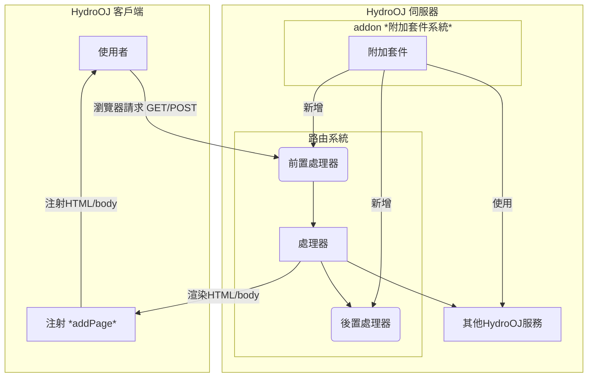

## HydroOJ 整體架構流程圖
注：下圖為 HydroOJ 整體架構流程圖，參考自 [官方repo](https://github.com/hydro-dev/Hydro) 非官方之圖式，有誤請不吝告知我們進行修正，謝謝！



## HydroOJ 套件資料夾結構
```
my-addon/
├── package.json
├── frontend?/
    ├── \[a-zA-Z0-9_\]+.page.tsx?
├── locales?/
    ├── ko.yml?
    ├── zh_TW.yml?
    ├── en.yml?
    ├── zh.yml?
├── public?/
├── templates?/
    ├── <>.html?
├── index.ts
```
有`?`的資料夾或檔案表示是選用的不是必須的
- `package.json`：套件的設定檔案 (預設就會有)
- `frontend/`：注射前端頁面檔案 (選用)
  - `\[a-zA-Z0-9_\]+.page.tsx`：注射前端頁面檔案 (選用)
- `locales/`：多國語系檔案 (選用)
- `public/`：靜態資源檔案 (選用)
- `templates/`：路由渲染前端模板檔案 (選用)
- `index.ts`：套件主要程式碼 (預設就會有)

## Handler 相關附錄

*路由名即該頁面的`data-page`屬性(可在瀏覽器開發者工具(按F12)中查看 會在最外層的`<html>`標籤中)

假設有一個路由是`ctx.Route('contest_create', '/contest/create', ContestEditHandler)`
- 路由名為`contest_create`
- Handler 名稱為`ContestEditHandler`

### 如何查詢 Handler 名稱
可以在 HydroOJ repo (或你要查的addon)中搜尋[路由定義ctx.Route()](https://github.com/hydro-dev/Hydro)
你會看到`ctx.Route('problem_list', '/p', ProblemListHandler);`之類的程式碼
來查看各個路由所對應的 Handler 名稱
ProblemListHandler 就是該路由(`/p`)所對應的 Handler 名稱
注：一個路由只會對應到一個 Handler 名稱
但一個 Handler 名稱可能會對應到多個路由(像是編輯頁面和查看頁面可能會共用同一個 Handler 名稱)


### 常用 Handler 名稱對照表

1. 首頁與用戶相關
| Handler 名稱 | 路由路徑 | 功能 | 常見擴展用途 |
|---|---|---|---|
| HomeHandler | / | 首頁 | 添加輪播圖、公告、統計信息 |
| UserDetailHandler | /user/:uid | 用戶詳情頁 | 添加 Rating、徽章、自定義資料 |
| UserLoginHandler | /login | 登錄頁 | 添加第三方登錄、驗證邏輯 |
| UserRegisterHandler | /register | 註冊頁 | 自定義註冊流程、邀請碼 |
| HomeSecurityHandler | /home/security | 安全設置 | 添加兩步驗證、設備管理 |
| HomeSettingsHandler | /home/settings/:category | 個人設置 | 添加自定義設置項 |

2. 題目相關
| Handler 名稱 | 路由路徑 | 功能 | 常見擴展用途 |
|---|---|---|---|
| ProblemListHandler | /p | 題目列表 | 添加篩選、標籤、難度分級 |
| ProblemDetailHandler | /p/:pid | 題目詳情 | 添加題解、討論、統計數據 |
| ProblemEditHandler | /p/:pid/edit | 編輯題目 | 添加批量操作、模板 |
| ProblemCreateHandler | /p/create | 創建題目 | 添加題目導入功能 |
| ProblemSubmitHandler | /p/:pid/submit | 提交代碼 | 添加代碼模板、預處理 |
| ProblemSolutionHandler | /p/:pid/solution | 題解列表 | 添加點贊、評論 |
| ProblemManageHandler | /p/:pid/manage | 題目管理 | 添加批量測試數據操作 |

3. 記錄與評測相關
| Handler 名稱 | 路由路徑 | 功能 | 常見擴展用途 |
|---|---|---|---|
| RecordListHandler | /record | 提交記錄列表 | 添加統計、篩選器 |
| RecordDetailHandler | /record/:rid | 提交記錄詳情 | 添加代碼高亮、性能分析 |
| JudgeConnectionHandler | /judge/conn | 評測機連接 | 自定義評測邏輯 |
| JudgeFilesDownloadHandler | /judge/files | 評測文件下載 | 自定義文件處理 |

4. 比賽相關
| Handler 名稱 | 路由路徑 | 功能 | 常見擴展用途 |
|---|---|---|---|
| ContestListHandler | /contest | 比賽列表 | 添加分類、報名狀態 |
| ContestDetailHandler | /contest/:tid | 比賽詳情 | 添加比賽公告、賽前提醒 |
| ContestScoreboardHandler | /contest/:tid/scoreboard | 排行榜 | 添加 Rating 變化、封榜 |
| ContestEditHandler | /contest/:tid/edit | 編輯比賽 | 添加模板、批量導入 |
| ContestCodeHandler | /contest/:tid/code | 查看代碼 | 添加代碼對比、查重 |

5. 作業相關
| Handler 名稱 | 路由路徑 | 功能 | 常見擴展用途 |
|---|---|---|---|
| HomeworkMainHandler | /homework | 作業列表 | 添加進度追蹤 |
| HomeworkDetailHandler | /homework/:tid | 作業詳情 | 添加提交狀態、截止提醒 |
| HomeworkScoreboardHandler | /homework/:tid/scoreboard | 作業排行榜 | 添加完成度統計 |

6. 討論相關
| Handler 名稱 | 路由路徑 | 功能 | 常見擴展用途 |
|---|---|---|---|
| DiscussionMainHandler | /discuss | 討論列表 | 添加分類、熱門話題 |
| DiscussionDetailHandler | /discuss/:did | 討論詳情 | 添加點贊、回覆樹 |
| DiscussionEditHandler | /discuss/:did/edit | 編輯討論 | 添加富文本編輯器 |
| DiscussionReplyHandler | /discuss/:did/reply | 回覆討論 | 添加 @ 提醒、表情 |

7. 域管理相關
| Handler 名稱 | 路由路徑 | 功能 | 常見擴展用途 |
|---|---|---|---|
| DomainDetailHandler | /domain/:domainId | 域詳情 | 添加域統計、公告 |
| DomainEditHandler | /domain/:domainId/edit | 編輯域 | 添加自定義配置項 |
| DomainUserHandler | /domain/:domainId/user | 域用戶管理 | 添加批量操作、角色管理 |
| DomainRankHandler | /domain/:domainId/rank | 域排行榜 | 添加多維度排名 |

8. 訓練相關
| Handler 名稱 | 路由路徑 | 功能 | 常見擴展用途 |
|---|---|---|---|
| TrainingListHandler | /training | 訓練計劃列表 | 添加推薦算法 |
| TrainingDetailHandler | /training/:tid | 訓練計劃詳情 | 添加進度可視化 |

9. 系統管理相關
| Handler 名稱 | 路由路徑 | 功能 | 常見擴展用途 |
|---|---|---|---|
| SystemMainHandler | /manage | 系統管理主頁 | 添加儀表板組件 |
| SystemDashboardHandler | /manage/dashboard | 系統儀表板 | 添加監控圖表 |
| SystemSettingHandler | /manage/setting | 系統設置 | 添加自定義設置項 |
| SystemUserImportHandler | /manage/userimport | 用戶導入 | 添加批量導入格式 |

### Handler 實例的詳細結構
```ts
interface Handler {
    // ===== 用戶相關 =====
    user: User;                    // 當前登錄用戶
    
    // ===== 域相關 =====
    domain: DomainDoc;             // 當前域文檔
    
    // ===== 請求相關 =====
    request: {
        path: string;              // 請求路徑，如 /p/1000
        method: string;            // HTTP 方法，如 GET, POST
        params: Record<string, any>; // URL 參數，如 { pid: '1000' }
        query: Record<string, any>;  // 查詢參數，如 { page: '1' }
        body: Record<string, any>;   // POST 數據
        ip: string;                // 客戶端 IP
        headers: Record<string, string>; // HTTP 頭
        cookies: Record<string, string>; // Cookies
        files?: Record<string, any>;     // 上傳的文件
        json?: boolean;            // 是否 JSON 請求
    };
    
    // ===== 響應相關 =====
    response: {
        body: any;                 // 響應數據（傳給模板）
        template?: string;         // 模板文件名
        type?: string;             // Content-Type
        status?: number;           // HTTP 狀態碼
        redirect?: string;         // 重定向 URL
        disposition?: string;      // Content-Disposition
        etag?: string;             // ETag
        headers?: Record<string, string>; // 自定義響應頭
    };
    
    // ===== 會話相關 =====
    session: {
        uid: number;               // 用戶 ID
        viewLang?: string;         // 界面語言
        sudo?: number;             // sudo 模式時間戳
        [key: string]: any;        // 其他會話數據
    };
    
    // ===== 解析後的參數 =====
    args: Record<string, any>;     // 通過 @param 裝飾器解析的參數
    
    // ===== 上下文 =====
    ctx: Context;                  // 插件上下文
}
```
特定 Handler 的額外屬性(範例)
```ts
// ProblemDetailHandler
interface ProblemDetailHandler extends Handler {
    pdoc: ProblemDoc;              // 題目文檔
    udoc?: User;                   // 題目作者信息
    psdoc?: any;                   // 題目狀態
}

// ContestDetailHandler
interface ContestDetailHandler extends Handler {
    tdoc: Tdoc;                    // 比賽文檔
    tsdoc?: any;                   // 比賽狀態
}

// RecordDetailHandler
interface RecordDetailHandler extends Handler {
    rdoc: RecordDoc;               // 記錄文檔
    pdoc?: ProblemDoc;             // 關聯的題目
    udoc?: User;                   // 提交用戶
}

// UserDetailHandler
interface UserDetailHandler extends Handler {
    udoc: User;                    // 用戶文檔
}
```


import Authors from '@site/src/components/DocsAuthor/AuthorCard';

<Authors authors={["14thAdvancedTeachingDirector"]} size="h3" />
