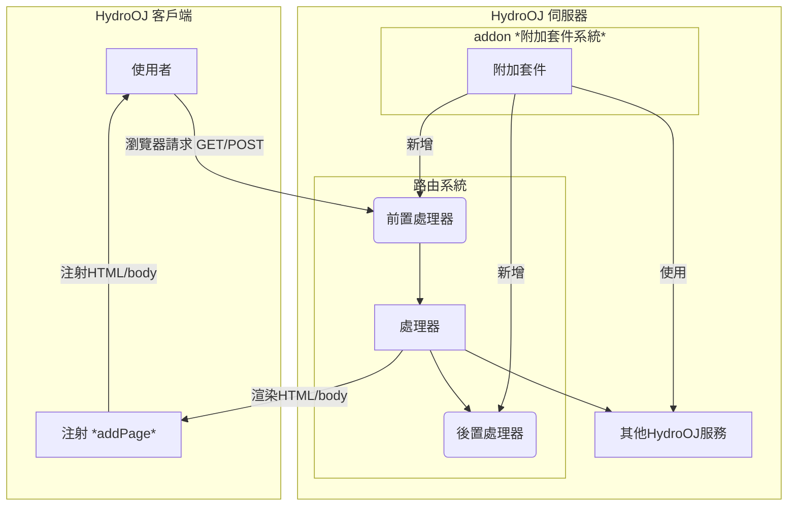
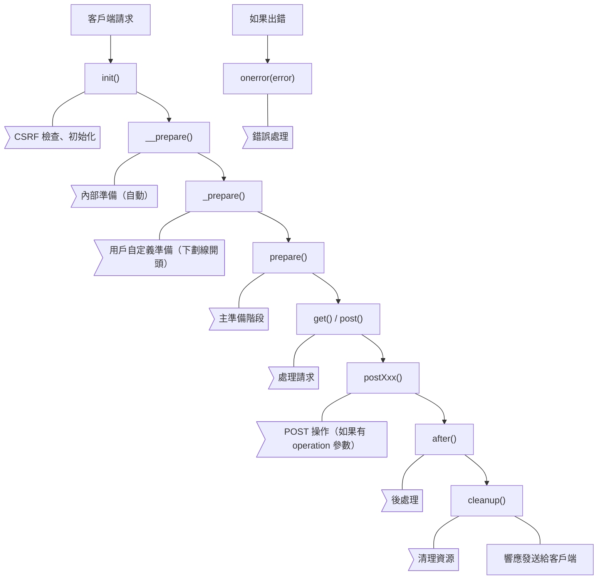
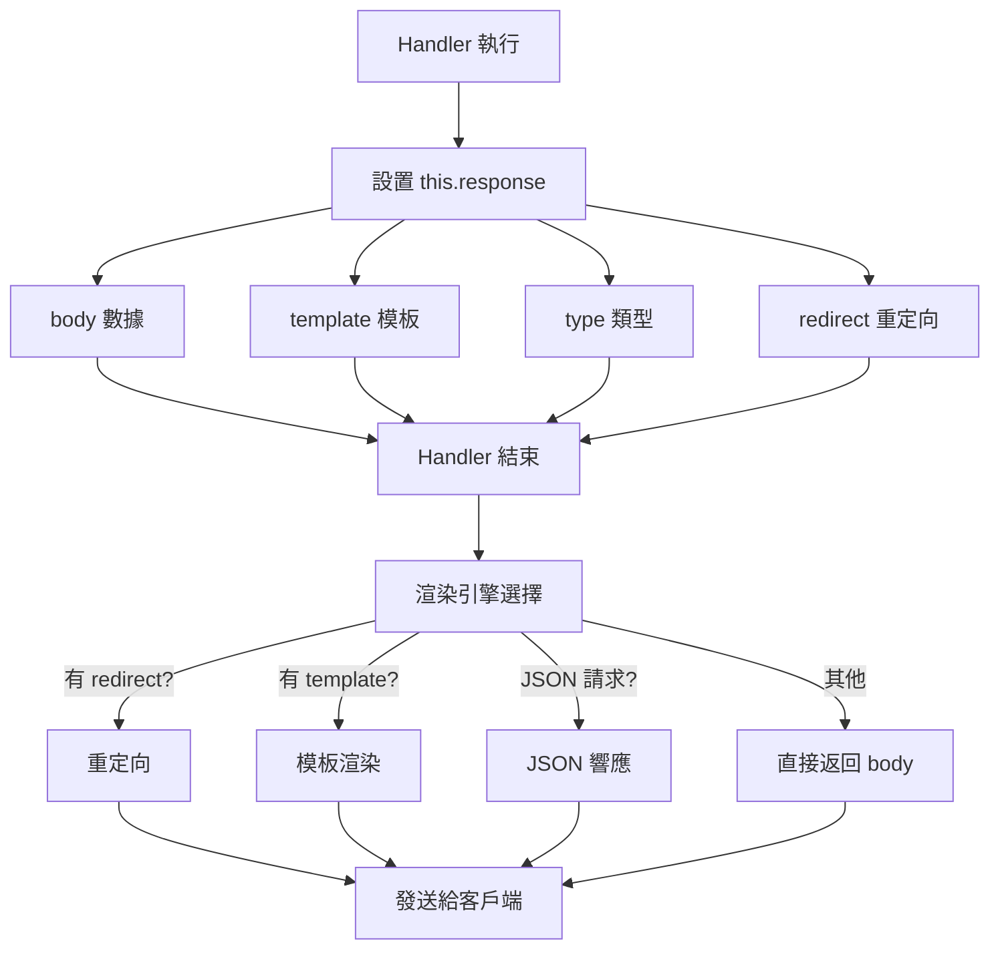
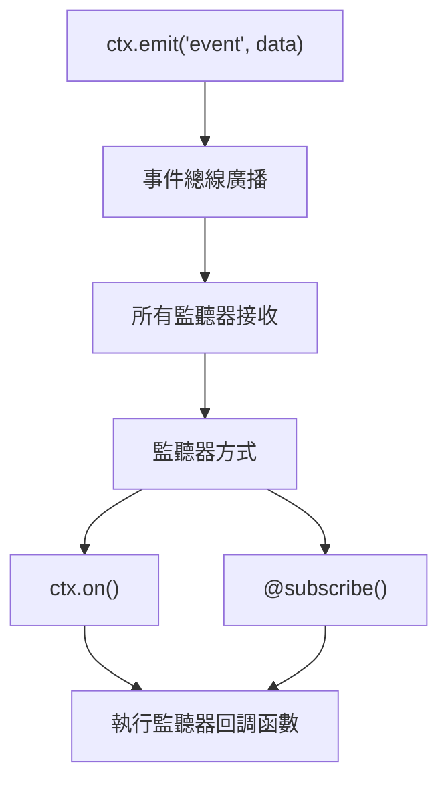

## HydroOJ 整體架構流程圖
注：下圖為 HydroOJ 整體架構流程圖，參考自 [官方repo](https://github.com/hydro-dev/Hydro) 非官方之圖式，有誤請不吝告知我們進行修正，謝謝！



## HydroOJ 套件資料夾結構
```
my-addon/
├── package.json
├── frontend?/
    ├── \[a-zA-Z0-9_\]+.page.tsx?
├── locales?/
    ├── ko.yml?
    ├── zh_TW.yml?
    ├── en.yml?
    ├── zh.yml?
├── public?/
├── templates?/
    ├── <>.html?
├── index.ts
```
有`?`的資料夾或檔案表示是選用的不是必須的
- `package.json`：套件的設定檔案 (預設就會有)
- `frontend/`：注射前端頁面檔案 (選用)
  - `\[a-zA-Z0-9_\]+.page.tsx`：注射前端頁面檔案 (選用)
- `locales/`：多國語系檔案 (選用)
- `public/`：靜態資源檔案 (選用)
- `templates/`：路由渲染前端模板檔案 (選用)
- `index.ts`：套件主要程式碼 (預設就會有)

## Handler 相關附錄

*路由名即該頁面的`data-page`屬性(可在瀏覽器開發者工具(按F12)中查看 會在最外層的`<html>`標籤中)

假設有一個路由是`ctx.Route('contest_create', '/contest/create', ContestEditHandler)`
- 路由名為`contest_create`
- Handler 名稱為`ContestEditHandler`

### 如何查詢 Handler 名稱
可以在 HydroOJ repo (或你要查的addon)中搜尋[路由定義ctx.Route()](https://github.com/hydro-dev/Hydro)
你會看到`ctx.Route('problem_list', '/p', ProblemListHandler);`之類的程式碼
來查看各個路由所對應的 Handler 名稱
ProblemListHandler 就是該路由(`/p`)所對應的 Handler 名稱
注：一個路由只會對應到一個 Handler 名稱
但一個 Handler 名稱可能會對應到多個路由(像是編輯頁面和查看頁面可能會共用同一個 Handler 名稱)


### 常用 Handler 名稱對照表

1. 首頁與用戶相關  

    | Handler 名稱 | 路由路徑 | 功能 | 常見擴展用途 |
    | --- | --- | --- | --- |
    | HomeHandler | / | 首頁 | 添加輪播圖、公告、統計信息 |
    | UserDetailHandler | /user/:uid | 用戶詳情頁 | 添加 Rating、徽章、自定義資料 |
    | UserLoginHandler | /login | 登錄頁 | 添加第三方登錄、驗證邏輯 |
    | UserRegisterHandler | /register | 註冊頁 | 自定義註冊流程、邀請碼 |
    | HomeSecurityHandler | /home/security | 安全設置 | 添加兩步驗證、設備管理 |
    | HomeSettingsHandler | /home/settings/:category | 個人設置 | 添加自定義設置項 |

2. 題目相關

    | Handler 名稱 | 路由路徑 | 功能 | 常見擴展用途 |
    |---|---|---|---|
    | ProblemListHandler | /p | 題目列表 | 添加篩選、標籤、難度分級 |
    | ProblemDetailHandler | /p/:pid | 題目詳情 | 添加題解、討論、統計數據 |
    | ProblemEditHandler | /p/:pid/edit | 編輯題目 | 添加批量操作、模板 |
    | ProblemCreateHandler | /p/create | 創建題目 | 添加題目導入功能 |
    | ProblemSubmitHandler | /p/:pid/submit | 提交代碼 | 添加代碼模板、預處理 |
    | ProblemSolutionHandler | /p/:pid/solution | 題解列表 | 添加點贊、評論 |
    | ProblemManageHandler | /p/:pid/manage | 題目管理 | 添加批量測試數據操作 |

3. 記錄與評測相關

    | Handler 名稱 | 路由路徑 | 功能 | 常見擴展用途 |
    |---|---|---|---|
    | RecordListHandler | /record | 提交記錄列表 | 添加統計、篩選器 |
    | RecordDetailHandler | /record/:rid | 提交記錄詳情 | 添加代碼高亮、性能分析 |
    | JudgeConnectionHandler | /judge/conn | 評測機連接 | 自定義評測邏輯 |
    | JudgeFilesDownloadHandler | /judge/files | 評測文件下載 | 自定義文件處理 |

4. 比賽相關

    | Handler 名稱 | 路由路徑 | 功能 | 常見擴展用途 |
    |---|---|---|---|
    | ContestListHandler | /contest | 比賽列表 | 添加分類、報名狀態 |
    | ContestDetailHandler | /contest/:tid | 比賽詳情 | 添加比賽公告、賽前提醒 |
    | ContestScoreboardHandler | /contest/:tid/scoreboard | 排行榜 | 添加 Rating 變化、封榜 |
    | ContestEditHandler | /contest/:tid/edit | 編輯比賽 | 添加模板、批量導入 |
    | ContestCodeHandler | /contest/:tid/code | 查看代碼 | 添加代碼對比、查重 |

5. 作業相關

    | Handler 名稱 | 路由路徑 | 功能 | 常見擴展用途 |
    |---|---|---|---|
    | HomeworkMainHandler | /homework | 作業列表 | 添加進度追蹤 |
    | HomeworkDetailHandler | /homework/:tid | 作業詳情 | 添加提交狀態、截止提醒 |
    | HomeworkScoreboardHandler | /homework/:tid/scoreboard | 作業排行榜 | 添加完成度統計 |

6. 討論相關

    | Handler 名稱 | 路由路徑 | 功能 | 常見擴展用途 |
    |---|---|---|---|
    | DiscussionMainHandler | /discuss | 討論列表 | 添加分類、熱門話題 |
    | DiscussionDetailHandler | /discuss/:did | 討論詳情 | 添加點贊、回覆樹 |
    | DiscussionEditHandler | /discuss/:did/edit | 編輯討論 | 添加富文本編輯器 |
    | DiscussionReplyHandler | /discuss/:did/reply | 回覆討論 | 添加 @ 提醒、表情 |

7. 域管理相關

    | Handler 名稱 | 路由路徑 | 功能 | 常見擴展用途 |
    |---|---|---|---|
    | DomainDetailHandler | /domain/:domainId | 域詳情 | 添加域統計、公告 |
    | DomainEditHandler | /domain/:domainId/edit | 編輯域 | 添加自定義配置項 |
    | DomainUserHandler | /domain/:domainId/user | 域用戶管理 | 添加批量操作、角色管理 |
    | DomainRankHandler | /domain/:domainId/rank | 域排行榜 | 添加多維度排名 |

8. 訓練相關

    | Handler 名稱 | 路由路徑 | 功能 | 常見擴展用途 |
    |---|---|---|---|
    | TrainingListHandler | /training | 訓練計劃列表 | 添加推薦算法 |
    | TrainingDetailHandler | /training/:tid | 訓練計劃詳情 | 添加進度可視化 |

9. 系統管理相關

    | Handler 名稱 | 路由路徑 | 功能 | 常見擴展用途 |
    |---|---|---|---|
    | SystemMainHandler | /manage | 系統管理主頁 | 添加儀表板組件 |
    | SystemDashboardHandler | /manage/dashboard | 系統儀表板 | 添加監控圖表 |
    | SystemSettingHandler | /manage/setting | 系統設置 | 添加自定義設置項 |
    | SystemUserImportHandler | /manage/userimport | 用戶導入 | 添加批量導入格式 |

### Handler 實例的詳細結構
```ts
interface Handler {
    // ===== 用戶相關 =====
    user: User;                    // 當前登錄用戶
    
    // ===== 域相關 =====
    domain: DomainDoc;             // 當前域文檔
    
    // ===== 請求相關 =====
    request: {
        path: string;              // 請求路徑，如 /p/1000
        method: string;            // HTTP 方法，如 GET, POST
        params: Record<string, any>; // URL 參數，如 { pid: '1000' }
        query: Record<string, any>;  // 查詢參數，如 { page: '1' }
        body: Record<string, any>;   // POST 數據
        ip: string;                // 客戶端 IP
        headers: Record<string, string>; // HTTP 頭
        cookies: Record<string, string>; // Cookies
        files?: Record<string, any>;     // 上傳的文件
        json?: boolean;            // 是否 JSON 請求
    };
    
    // ===== 響應相關 =====
    response: {
        body: any;                 // 響應數據（傳給模板）
        template?: string;         // 模板文件名
        type?: string;             // Content-Type
        status?: number;           // HTTP 狀態碼
        redirect?: string;         // 重定向 URL
        disposition?: string;      // Content-Disposition
        etag?: string;             // ETag
        headers?: Record<string, string>; // 自定義響應頭
    };
    
    // ===== 會話相關 =====
    session: {
        uid: number;               // 用戶 ID
        viewLang?: string;         // 界面語言
        sudo?: number;             // sudo 模式時間戳
        [key: string]: any;        // 其他會話數據
    };
    
    // ===== 解析後的參數 =====
    args: Record<string, any>;     // 通過 @param 裝飾器解析的參數
    
    // ===== 上下文 =====
    ctx: Context;                  // 插件上下文
}
```
特定 Handler 的額外屬性(範例)
```ts
// ProblemDetailHandler
interface ProblemDetailHandler extends Handler {
    pdoc: ProblemDoc;              // 題目文檔
    udoc?: User;                   // 題目作者信息
    psdoc?: any;                   // 題目狀態
}

// ContestDetailHandler
interface ContestDetailHandler extends Handler {
    tdoc: Tdoc;                    // 比賽文檔
    tsdoc?: any;                   // 比賽狀態
}

// RecordDetailHandler
interface RecordDetailHandler extends Handler {
    rdoc: RecordDoc;               // 記錄文檔
    pdoc?: ProblemDoc;             // 關聯的題目
    udoc?: User;                   // 提交用戶
}

// UserDetailHandler
interface UserDetailHandler extends Handler {
    udoc: User;                    // 用戶文檔
}
```

### Handler 生命週期流程圖


### 渲染機制流程圖


## template 模板系統相關附錄
模板引擎使用 Nunjucks
```ts
// 來源: packages/ui-default/backendlib/template.ts
export class TemplateService extends Service {
  constructor(ctx: Context) {
    super(ctx, 'template');
    
    // 設置 Nunjucks 環境
    const env = new Nunjucks(Loader);
    
    // 註冊過濾器
    env.addFilter('json', JSON.stringify);
    env.addFilter('translate', (str) => this.translate(str));
    
    // 註冊全局變量
    env.addGlobal('UiContext', UiContext);
    env.addGlobal('formatDate', formatDate);
  }
  
  // 渲染模板
  render(name: string, context: any) {
    return this.env.render(name, context);
  }
}
```

模板上下文
```ts
// Handler 渲染時自動注入的上下文
const templateContext = {
  // Handler 相關
  handler: this,           // Handler 實例
  user: this.user,         // 當前用戶
  domain: this.domain,     // 當前域
  
  // 請求相關
  request: this.request,   // 請求對象
  args: this.args,         // URL 參數
  
  // 響應數據
  ...this.response.body,   // 響應體數據
  
  // UI 上下文
  UiContext: this.UiContext,  // UI 配置
  
  // 輔助函數
  url: this.url.bind(this),          // URL 生成
  _: this.translate.bind(this),      // 翻譯函數
  formatDate: (date) => ...,         // 日期格式化
  avatar: (hash) => ...,             // 頭像 URL
};
```


## Service 服務相關附錄

### 如何查詢 Service 服務名稱
可以在 HydroOJ repo (或你要查的addon)中搜尋服務註冊代碼範例
```ts
// 示例 1: MongoService
// 來源: packages/hydrooj/src/service/db.ts
export class MongoService extends Service {
    constructor(ctx: Context, private config: MongoConfig = {}) {
        super(ctx, 'db');  // ← 註冊為 'db'
        //         ^^^^ 這就是服務名稱
    }
}
```

這樣就可以知道服務註冊名稱`db`對應的服務類型`MongoService`

### 常用 Service 名稱對照表

| 服務註冊名稱 | 服務類型/實例 (TypeScript 類型)  | 功能描述 |
|---|---|---|
| db | MongoService | MongoDB 數據庫操作服務 |
| server | WebService | HTTP 服務 |
| setting | SettingService | 系統設置服務 |
| loader | Loader | 加載器服務 |
| worker | WorkerService | 工作線程服務 |
| i18n | I18nService | 國際化服務 |
| oauth | OauthModel | OAuth 認證模型 |
| api | ApiService | API 服務 |
| check | CheckService | 檢查服務 |
| template | TemplateService | 模板服務 |
| scoreboard | ScoreboardService | 排行榜服務 |

## 事件相關附錄

### 事件系統架構圖

所以只要查`ctx.emit`就可以找到事件名字了

### 事件類型
1. Handler 生命週期事件
- `handler/before/<HandlerClassName>`：在指定的**處理器**執行前觸發
- `handler/after/<HandlerClassName>`：在指定的**處理器**執行後觸發
- `handler/before/<routeName>`：在指定的**路徑**載入前觸發
- `handler/after/<routeName>`：在指定的**路徑**載入後觸發

2. 應用生命週期事件
- `app/started`：應用啟動完成
- `app/listen`：服務器開始監聽
- `app/ready`：應用就緒

3. 業務邏輯事件
- `user/login`：用戶登入
- `user/register`：用戶註冊
- `problem/add`：新增題目
- `record/judge`：評測記錄判定
- `contest/end`：比賽結束

4. 其他事件
- `system/setting`：系統設置變更
- `domain/create`：域創建

## 未歸檔
### storage
```ts
// packages/hydrooj/src/model/storage.ts
class StorageModel { /* ... */ }
global.Hydro.model.storage = StorageModel;
export default StorageModel;
```
```ts
// 方式 1: 直接使用（推薦）
await storage.put(path, file);

// 方式 2: 通過 global
await global.Hydro.model.storage.put(path, file);

// 方式 3: 導入
import StorageModel from 'hydrooj/src/model/storage';
await StorageModel.put(path, file);
```
- 常用 API
    - `storage.put()` - 上傳文件
    - `storage.get()` - 下載文件
    - `storage.del()` - 刪除文件
    - `storage.signDownloadLink()` - 生成下載鏈接
    - `storage.list()` - 列出文件
    - `storage.exists()` - 檢查文件是否存在


import Authors from '@site/src/components/DocsAuthor/AuthorCard';

<Authors authors={["14thAdvancedTeachingDirector"]} size="h3" />
