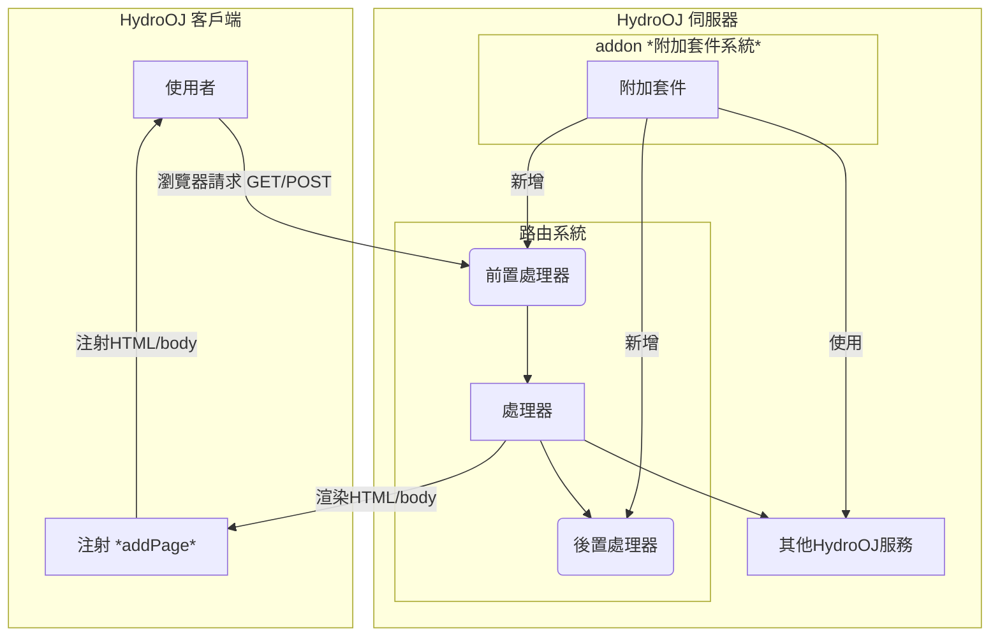

## HydroOJ 整體架構流程圖
注：下圖為 HydroOJ 整體架構流程圖，參考自 [官方repo](https://github.com/hydro-dev/Hydro) 非官方之圖式，有誤請不吝告知我們進行修正，謝謝！



## HydroOJ 套件資料夾結構
```
my-addon/
├── package.json
├── frontend?/
    ├── \[a-zA-Z0-9_\]+.page.tsx?
├── locales?/
    ├── ko.yml?
    ├── zh_TW.yml?
    ├── en.yml?
    ├── zh.yml?
├── public?/
├── templates?/
    ├── <>.html?
├── index.ts
```
有`?`的資料夾或檔案表示是選用的不是必須的
- `package.json`：套件的設定檔案 (預設就會有)
- `frontend/`：注射前端頁面檔案 (選用)
  - `\[a-zA-Z0-9_\]+.page.tsx`：注射前端頁面檔案 (選用)
- `locales/`：多國語系檔案 (選用)
- `public/`：靜態資源檔案 (選用)
- `templates/`：路由渲染前端模板檔案 (選用)
- `index.ts`：套件主要程式碼 (預設就會有)

import Authors from '@site/src/components/DocsAuthor/AuthorCard';

<Authors authors={["14thAdvancedTeachingDirector"]} size="h3" />
