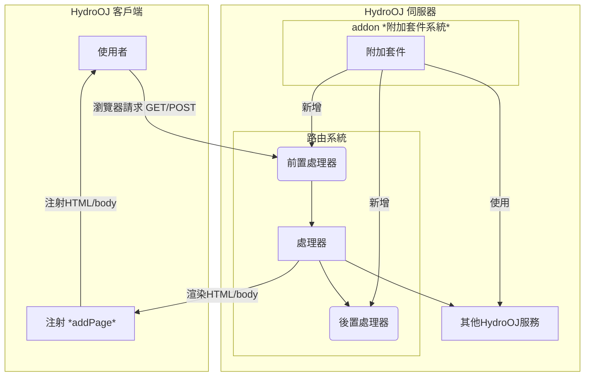

注：下圖為 HydroOJ 整體架構流程圖，參考自 [官方repo](https://github.com/hydro-dev/Hydro) 非官方之圖式，有誤請不吝告知我們進行修正，謝謝！

import Authors from '@site/src/components/DocsAuthor/AuthorCard';

<Authors authors={["14thAdvancedTeachingDirector"]} size="h3" />
