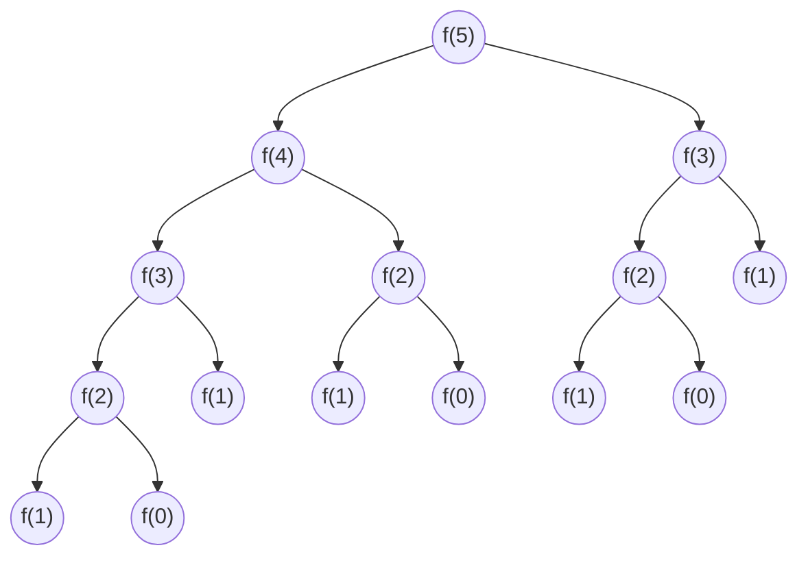
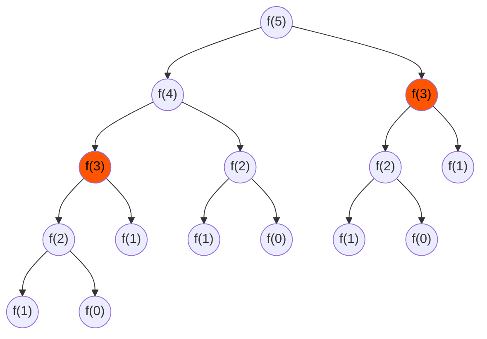
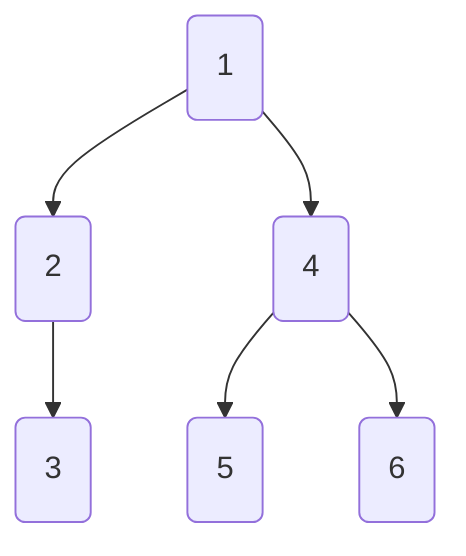

import Slide, { SlideBreak, BranchBreak } from '@site/src/components/Slides/MarkdownSlides.tsx';

# DP與DFS
<Slide>

# DP與DFS

<SlideBreak />

## 先備知識

遞迴  
<pre><code className="language-cpp">
{`
int fibonacci(int n)
{
	//遞迴終止條件
	if(n == 0)return 0;
	if(n == 1)return 1;
	
	//向下遞迴
	int l = fibonacci(n-1);
	int r = fibonacci(n-2);
	
	//回傳結果
	return l+r;
}
int main()
{
	int ret = fibonacci(5);
}
`}
</code></pre>

<BranchBreak />

視覺化過程

<BranchBreak />

## 時間複雜度

- 可以觀察到剛才那張圖近似於滿二叉樹，滿二叉樹有 $2^n - 1$ 個節點，因此剛剛那份程式碼的時間複雜度是$O(2^n)$
- 可以更好嗎?
- 可以！！！

<BranchBreak />

回到那張圖

可以注意到，$f(3)$在第二次被呼叫的時候我們其實已經可以知道$f(3)$的值，不用再算一次$f(3)$

<BranchBreak />

## 新code

<pre><code className="language-cpp">
{`
vector<int> dp = {0, 1};
int fibonacci(int n)
{
    //遞迴終止條件(算過的不要再算)
    if(n < dp.size())if(dp[n] != -1)return dp[n];
    
    //向下遞迴
    int l = fibonacci(n-1);
    int r = fibonacci(n-2);
    
    //紀錄算過的
    if(n >= dp.size())dp.resize(n+1, -1);
    dp[n] = l+r;
    
    
    //回傳結果
    return dp[n];
}
int main()
{
    int ret = fibonacci(5);
}
`}
</code></pre>
- 時間複雜度看起來很難分析(?
- 換一種方式寫！

<BranchBreak />

我們可以注意到  
<pre><code className="language-cpp">
{`
int l = fibonacci(n-1);
int r = fibonacci(n-2);
`}
</code></pre>
只會調用到n之前的前兩項而已
所以，我們可以從$n$較小推到比較高的部分

<BranchBreak />

<pre><code className="language-cpp">
{`
vector<int> dp = {0, 1};
int fibonacci(int n)
{
    //算過的不要再算
    if(n < dp.size())return dp[n];
    
    //從低往高推
    for(int i = dp.size(); i <= n; i++)
    {
        dp.push_back(dp[i-1]+dp[i-2]);
    }
    
    //回傳結果
    return dp[n];
}
int main()
{
    int ret = fibonacci(5);
}
`}
</code></pre>
這樣對於每一個節點都只會是$O(1)$的時間
因此$fibonacci(n)$的時間複雜度是$O(n)$

<BranchBreak />

剛剛我們把「算過的東西存起來」就是DP的核心概念

<SlideBreak />

## DFS

Depth-First-Search
深度優先搜尋
故名思義
是「深度」優先的搜尋法

<BranchBreak />

實際運行

<BranchBreak />

可以發現到他遍歷方法和遞迴樹一樣
所以我們可以用遞迴的方式實作DFS

<BranchBreak />

<pre><code className="language-cpp">
{`
struct Node
{
    Node *l = nullptr, *r = nullptr;  
};
void dfs(Node *n)
{
    if(n == nullptr)return;
    dfs(n->l);
    dfs(n->r);
    return;
}
`}
</code></pre>

</Slide>
