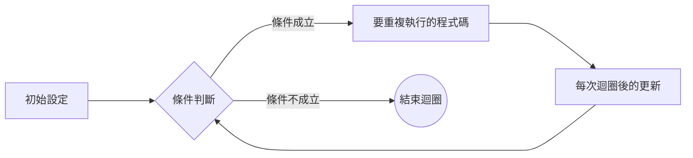

## for
C++ 的 for 迴圈是一種計數型迴圈，適合在**事先知道要重複執行的次數**時使用。（不知道次數的後面會講）
它的基本語法是：
```cpp=
for (初始設定; 條件判斷; 每次迴圈後的更新) {
    // 要重複執行的程式碼
}
```



初始設定：通常用來宣告並設定計數變數，例如 `int i = 0`。

條件判斷：每次迴圈開始前檢查，如果條件是 `true`就執行迴圈內容；如果是 `false`就結束迴圈。

更新：每次迴圈結束後執行的動作，通常是計數變數加減，例如 `i++`。
### 範例
```cpp=
#include <iostream>
using namespace std;

int main() {
    for (int i = 0; i < 5; i++) {
        cout << "i = " << i << endl;
    }
    return 0;
}
```
### 輸出：
```cpp=
i = 0
i = 1
i = 2
i = 3
i = 4
```
:::warning
順帶一提，括號裡面的初始設定、條件判斷、每次迴圈後的更新這三個東西可以放任何東西，所以下面這些東西也等同於上面的範例:     owob
1.初始設定丟外面
```cpp=
#include <iostream>
using namespace std;
int main() {
    int i = 0;
    for (; i < 5; i++) {
        cout << i << '\n';
    }
    return 0;
}
```
2.條件判斷丟迴圈裡面:
```cpp=
#include <iostream>
using namespace std;
int main() {
    for (int i = 0;; i++) {
        if (i == 5) {
            break; //後面有寫這是啥 (不能吃owo)
        }
        cout << i << '\n';
    }
    return 0;
}
```
3.每次迴圈後的更新放迴圈裡:
```cpp=
#include <iostream>
using namespace std;
int main() {
    for (int i = 0; i < 5;) {
        cout << i << '\n';
        i++;
    }
    return 0;
}
```
4.全部都放在括號以外的地方:
```cpp=
#include <iostream>
using namespace std;
int main() {
    int i = 0;
    for (;;) {
        if (i == 5) {
            break;
        }
        cout << i << '\n';
        i++;
    }
    return 0;
}
```
另外，若是想要其中一個部分有多個想執行的指令，可以用`,`隔開，例如每次迴圈後的更新想要有兩個，就可以這麼寫:
```cpp=
#include <iostream>
using namespace std;
int main() {
    int a = 0;
    for (int i = 0; i < 5; i++, a++) {
        cout << i << ' ' << a << '\n';
    }
    return 0;
}
```
輸出為:
```css=
0 0
1 1
2 2
3 3
4 4
```
:::
## while
C++ 的 `while` 迴圈是一種條件型迴圈，適合在不知道要重複幾次，但有明確結束條件時使用。


```cpp=
while (條件判斷) {
    // 只要條件為 true，就一直執行這裡的程式碼
}
```
 **執行流程**
1.先檢查條件判斷。
2.如果條件是 `true` → 執行迴圈內容。
3.執行完後回到步驟 1。
4.如果條件是 `false` → 結束迴圈。
### 範例：
```cpp=
#include <iostream>
using namespace std;

int main() {
    int i = 0;
    while (i < 5) {
        cout << "i = " << i << endl;
        i++; // 記得更新，否則會變成無窮迴圈
    }
    return 0;
}
```
:::info
#### 當助教的題目說有t筆測資的時候就可以這麼做:
```cpp=
#include <iostream>
using namespace std;
int main() {
    int t;
    cin >> t;
    while (t--) {
        // 解題code
    }
    return 0;
}
```
:::
:::info
#### 當DDJ上面有題目說它是多筆測資但沒說多少筆時就可以這麼做:
```cpp=
#include <iostream>
using namespace std;
int main() {
    int n;
    while (cin >> n) { //n是每筆測資的第一項輸入的值
        // 解題code
    }
    return 0;
}
```
:::
### continue
當迴圈中執行到此式時，就會跳過當前迴圈中剩下的所有程式回到當前迴圈最上面
如果是`for`就是回到每次迴圈後的更新，如果是`while`就是回到條件判斷
```cpp=
#include<iostream>
using namespace std;
int main(){
    for(int i = 1; i <= 10; i++){
        if(i % 2 == 0){
            continue;    //如果判斷i是偶數，就回到i++，不執行cout。
        }
        cout << i << ' '; //輸出為 1 3 5 7 9
    }
}
```
### break
當迴圈內的程式執行達到某一條件，不用再執行接下來的程式碼和迴圈時，可以在中間加入`break`。
當執行到`break`時程式會直接跳出當前迴圈去執行迴圈接下來的程式。

```cpp=
#include<iostream>
using namespace std;
int main(){
    for(int i = 1; i <= 10; i++){
        if(i == 5){
            break;    //如果判斷i是5，就跳出迴圈，不執行cout。
        }
        cout << i << ' '; //輸出為 1 2 3 4
    }
}
```
值得注意的是，不論是`continue`還是`break`，作用的對象都僅為當前迴圈，不會擴及更外層的東西。聽起來非常抽象，所以以下有雙層for迴圈的範例:
```cpp=
#include <iostream>
using namespace std;
int main() {
    for (int i = 1; i <= 3; i++) {
        for (int j = 1; j <= 3; j++) {
            if (j == 2) {
                continue; //如果j是2就回到j++的地方並繼續執行
            }
            cout << "當前(i,j)=(" << i << ',' << j << ") ";
        }
        cout << '\n'; //此換行的執行完全不受continue影響
    }
    return 0;
}
```
輸出為:
```css=
當前(i,j)=(1,1) 當前(i,j)=(1,3) 
當前(i,j)=(2,1) 當前(i,j)=(2,3)
當前(i,j)=(3,1) 當前(i,j)=(3,3)
```

範例part2:
```cpp=
#include <iostream>
using namespace std;
int main() {
    for (int i = 1; i <= 3; i++) {
        for (int j = 1; j <= 3; j++) {
            if (j == 2) {
                break; //如果j是2就跳出當前迴圈(j這個迴圈)，並繼續執行迴圈下面的程式
            }
            cout << "當前(i,j)=(" << i << ',' << j << ") ";
        }
        cout << '\n'; //此換行的執行完全不受break影響
    }
    return 0;
}
```
輸出為:
```css=
當前(i,j)=(1,1) 
當前(i,j)=(2,1)
當前(i,j)=(3,1)
```

## 段落小結
迴圈是一個很重要的東西，務必要把概念弄懂，了解它執行的過程，才能將迴圈玩轉於程式之中。
搭配上`continue`以及`break`，又可以將迴圈的功能加強。
(迴圈基本上所有地方都會用到，使用率高的驚人，務必熟悉!!!)
如果概念不是很懂的話可以嘗試先自己隨便寫幾個迴圈執行試試，透過執行結果去理解它跑動的過程。等到概念大概懂了之後，可以多刷一點題目，刷多了迴圈也就用的熟悉了。

---